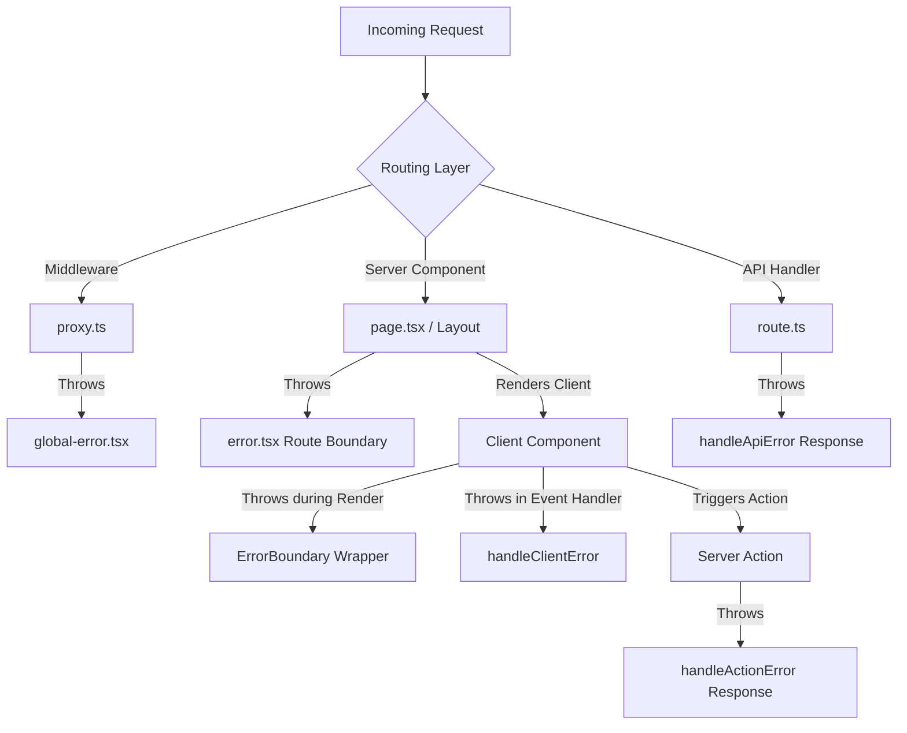

# Enterprise Error Handling Architecture Guide

This module provides a unified, type-safe, and environment-aware error handling framework designed for Next.js App Router applications. It enforces Clean Architecture and separates transport, normalization, serialization, and telemetry concerns.

---

## 1. Directory Structure

```text
src/lib/errors/
├── constants.ts          # Structured error code list (e.g. AUTH_001, VALIDATION_001)
├── types.ts              # Type definitions (ErrorContext, SerializedError)
├── AppError.ts           # Base class extending Error
├── ValidationError.ts    # Status 400 validation helper
├── AuthenticationError.ts # Status 401 unauthenticated helper
├── AuthorizationError.ts  # Status 403 unauthorized helper
├── NotFoundError.ts      # Status 404 resource not found
├── NetworkError.ts       # Status 503 offline / connection errors
├── ApiError.ts           # Status 500 API request failure
├── UnknownError.ts       # Status 500 generic fallback
├── logger.ts             # Environment-aware logging layer
├── normalize-error.ts    # Translates native / Axios errors into AppErrors
├── serialize-error.ts    # Prepares errors safely for client delivery
├── utils.ts              # Action, API, server, and client handlers
└── index.ts              # Exports rollup
```

---

## 2. Core Architectural Principles

### Separation of Concerns
Errors should not know how they are transported, logged, or serialized.
* **Exceptions (`AppError`)** only represent logical errors and carry metadata.
* **Logging (`logger.ts`)** takes context and records error metrics.
* **Serialization (`serialize-error.ts`)** removes stack traces in production to prevent security leaks.

### Structured Error Codes
Never rely on parsing error messages. Message text changes, but error codes are stable contracts.
Every custom error class maps to a stable code:

| Error Class | Status Code | Stable Code | Use Case |
| :--- | :--- | :--- | :--- |
| `ValidationError` | `400` | `VALIDATION_001` | Form submissions, request body validation |
| `AuthenticationError` | `401` | `AUTH_001` | Expired tokens, missing session credentials |
| `AuthorizationError` | `403` | `AUTH_002` | Insufficient permissions, role limits |
| `NotFoundError` | `404` | `NOT_FOUND_001` | Database row missing, page not found |
| `NetworkError` | `503` | `NETWORK_001` | Server offline, Axios timeout |
| `ApiError` | `500` | `API_001` | Third-party microservice failure |
| `UnknownError` | `500` | `UNKNOWN_001` | Fallback catch for untyped exceptions |

---

## 3. Next.js App Router Integration Matrix

Different layers in Next.js require different error containment strategies:



### When to use each boundary:

> [!TIP]
> Use **Route Boundaries (`error.tsx`)** for major features (e.g., dashboard, settings) so that a failure in one sidebar doesn't crash the entire website layout.

> [!IMPORTANT]
> Keep **`global-error.tsx`** lightweight. It contains its own `<html>` and `<body>` tags and only executes during fatal root layout rendering crashes.

> [!NOTE]
> Use **React Class ErrorBoundaries** to wrap third-party widgets (e.g., calendars, maps, charts) to show a small fallback box or diagnostic alert without taking the route offline.

---

## 4. What Boundaries Do NOT Catch

React Error Boundaries and route-level `error.tsx` files **do not catch**:
1. **Event Handlers**: E.g., `onClick` clicks throwing errors. Handlers run outside of the React render cycle.
   * *Resolution*: Wrap handler logic in `try/catch` and invoke `handleClientError(error)`.
2. **Asynchronous Callbacks**: E.g., `setTimeout`, `requestAnimationFrame`.
   * *Resolution*: Handle locally inside the asynchronous callback code.
3. **Server Actions**: Exceptions thrown inside server actions are caught by Next.js and masked as generic client-side errors.
   * *Resolution*: Wrap the action logic in `handleActionError` to return a typed, serialized payload containing safe validation details.
4. **Middleware & Route Handlers**: Execution happens before/outside React rendering.
   * *Resolution*: Wrap code inside `try/catch` and delegate using `handleApiError(error)`.

---

## 5. Recommended Production Telemetry Integration

The logging module (`logger.ts`) is designed to support custom backends. In production, change `sendToTelemetry` to point directly to your logging SaaS:

```ts
// Example Sentry / Datadog integration in logger.ts
import * as Sentry from '@sentry/nextjs';

sendToTelemetry(payload: Record<string, unknown>): void {
  const errorObj = payload.error instanceof Error ? payload.error : new Error(String(payload.message));
  
  Sentry.captureException(errorObj, {
    extra: payload,
    tags: {
      errorCode: String(payload.code),
      level: String(payload.level),
    }
  });
}
```

---

## 6. Common Mistakes to Avoid

1. **Leaking Stack Traces**: Never return raw `error.stack` or raw query strings directly to clients in production. Always run them through `serializeError` to filter internal information.
2. **Re-rendering Loops**: Ensure your retry button triggers a state reset on the Error Boundary (`reset()`), rather than causing the parent component to immediately try to re-render the failing code.
3. **Importing client components inside Server Layouts**: Keep error fallbacks clearly marked with `'use client';` so they run in the browser sandbox.
